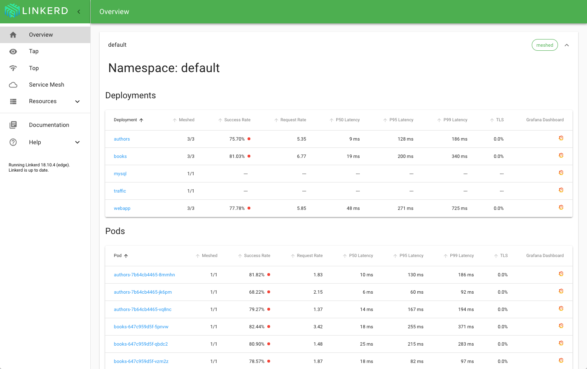

# Buoyant Books App #

This is a sample distributed (microservices) Ruby app using Sinatra,
ActiveRecord, and ActiveResource. The app is designed to demonstrate the various
value propositions of Linkerd 2.0 including debugging, observability, and
monitoring. Some of the services in the app periodically fail. This is by design
in order to demo debugging and monitoring in Linkerd 2.0.

The application is composed of the following four services:

* [webapp.rb](webapp.rb)
* [authors.rb](authors.rb)
* [books.rb](books.rb)
* [traffic/main.go](traffic/main.go) (demo traffic generator, written in Go)


---

## Running in Kubernetes ##

You can deploy the application to Kubernetes using the Linkerd 2.0 service mesh.

1. Install the `linkerd` CLI

    ```bash
    curl https://run.linkerd.io/install | sh
    ```

2. Install the Linkerd control plane

    ```bash
    linkerd install | kubectl apply -f -
    ```

3. Inject and deploy the application

    ```bash
    curl https://run.linkerd.io/booksapp.yml | linkerd inject - | kubectl apply -f -
    ```

4. Use the app!

    ```
    kubectl port-forward svc/webapp 7000
    open "http://localhost:7000"
    ```

5. View the Linkerd dashboard!

    ```bash
    linkerd dashboard
    ```



---

## Running Locally ##

You can also run the application locally for development.

1. Create, migrate, and seed the database:

    ```bash
    bundle install
    bundle exec rake db:create
    bundle exec rake db:migrate
    bundle exec rake db:seed
    ```

2. Start the web app:

    ```bash
    bundle exec rake dev:webapp
    ```

3. Start the authors app:

    ```bash
    bundle exec rake dev:authors
    ```

4. Start the books app:

    ```bash
    bundle exec rake dev:books
    ```

5. Open the website:

    ```bash
    open "http://localhost:7000"
    ```


